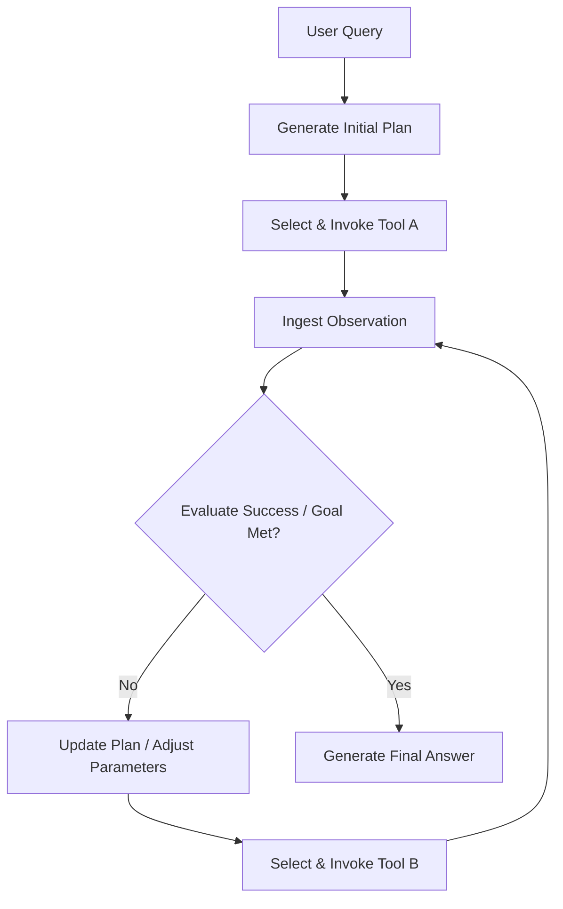

# Multi-Step Autonomous Loops (Agentic TAG)

Multi-Step Autonomous Loops are deployed when the user query is abstract or requires long-horizon planning. The agent decides which tools to call, inspects intermediate results, and dynamically updates its plan.

## Architecture & Flow

The model continuously updates a plan, executing different tools depending on what it discovers at each step.

## Key Characteristics
- **Long-Horizon Planning:** The model maintains state and plans multiple moves in advance.
- **Dynamic Decision Making:** Adapts parameters or changes the selection of tools based on intermediate errors or findings.
- **Foundational Paper:** [WebGPT: Browser-assisted question-answering with human feedback](https://arxiv.org/abs/2112.09332) (Nakano et al., 2021).
