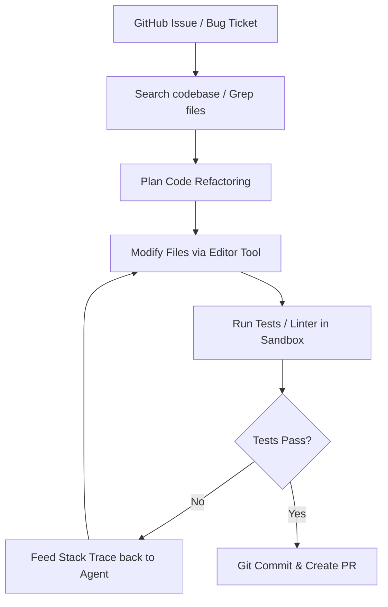

# Autonomous Software Development & Repository Maintenance

Autonomous agents can resolve complex software tickets, maintain dependencies, and refactor codebases by interfacing with terminal commands, file editors, compilers, and test suites.

## Architecture & Flow

The agent views files, edits lines of code, runs tests, reads compiler errors, and loops until the entire test suite passes successfully.

## Key Characteristics
- **Agent-Computer Interfaces (ACI):** Specializing tools specifically for models (e.g., viewing paginated files instead of raw dumps).
- **Test-Driven Refactoring:** Assuring correctness through compiler or execution feedback loops.
- **Foundational Paper:** [SWE-agent: Agent-Computer Interfaces Enable LLMs to Resolve Real-World GitHub Issues](https://arxiv.org/abs/2405.15793) (Yang et al., 2024).
