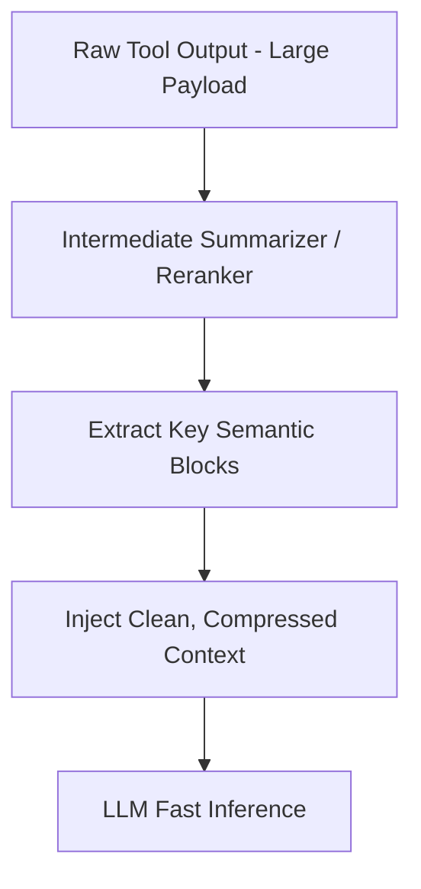

# The Context Inflation & Latency Bottleneck

A significant challenge in Tool-Augmented Generation is that raw output from tools (like database records or full webpage dumps) can be extremely large, which inflates the LLM's active context window, slows down inference, and raises API costs.

## Architecture & Flow

Large outputs are processed through an intermediate compression layer (like summarization kernels or semantic rerankers) to keep the context size minimal.

## Key Characteristics
- **Latency Optimization:** Compressing context maintains low TTFT (Time to First Token) and overall generation speed.
- **Cost Reduction:** Reduces the input token count sent to commercial LLM APIs.
- **Foundational Paper:** [Lost in the Middle: How Language Models Use Long Contexts](https://arxiv.org/abs/2307.03172) (Liu et al., 2023).
