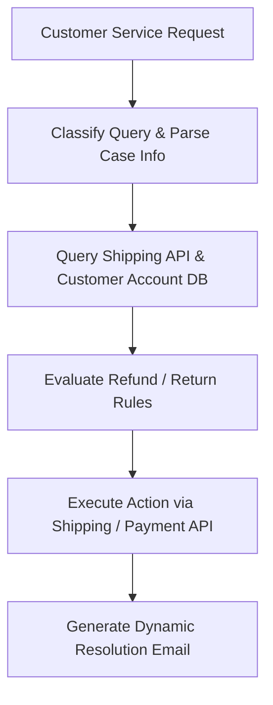

# Enterprise Customer Relationship Management (CRM) Orchestration

Integrating agents with CRM databases (e.g., Salesforce) automates customer query classification, refund calculations, inventory checks, and shipping status tracking dynamically.

## Architecture & Flow

A customer case triggers an agent loop that queries database records and executes CRM state modifications.

## Key Characteristics
- **Multi-API Integration:** Orchestrates payment, shipping, email, and database tools.
- **Strict Guardrails:** Restricting operations based on customer privilege tiers and safety rules.
- **Foundational Paper:** [CRMArena: Understanding the Capacity of LLM Agents to Perform Professional CRM Tasks in Realistic Environments](https://arxiv.org/abs/2411.02305) (Huang et al., 2024).
