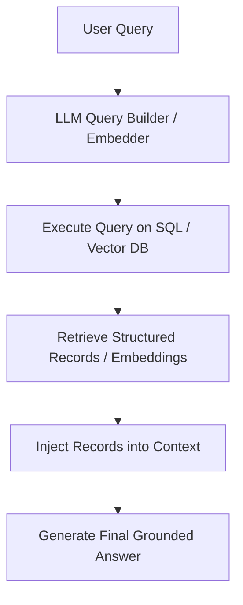

# Dynamic Structural Data Stores (SQL / Vector Databases)

Enterprise data is typically stored in databases. This paradigm allows the model to interface directly with SQL databases (via query building) or Vector Databases (for semantic document retrieval) to retrieve private enterprise records.

## Architecture & Flow

The LLM translates natural language into structured queries or vector representations, retrieves relevant data, and uses it to construct the answer.

## Key Characteristics
- **Dynamic Context Injection:** Retrieves fresh, private documents or specific records.
- **Enterprise Utilities:** Enables Text-to-SQL dashboards and internal RAG applications.
- **Foundational Paper:** [Retrieval-Augmented Generation for Knowledge-Intensive NLP Tasks](https://arxiv.org/abs/2005.11401) (Lewis et al., 2020).
