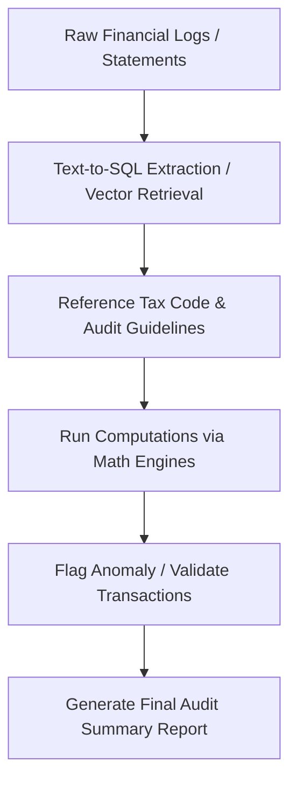

# Automated Corporate Financial & Tax Auditing Workflows

In accounting and compliance, tool-augmented systems are used to verify transactions, cross-reference department logs, calculate tax liabilities, and identify compliance variances automatically.

## Architecture & Flow

The system queries transaction logs, references federal/local tax codes, processes equations via python scripts, and writes a compliance draft.

## Key Characteristics
- **Explainable Anomaly Detection:** Grounding audit logs in regulatory texts.
- **Accurate Computations:** Pairing SQL record queries with python math runtime environments.
- **Foundational Paper:** [Towards Automated Regulatory Compliance Verification in Financial Auditing with Large Language Models](https://arxiv.org/abs/2507.16642) (Berger et al., 2023).
