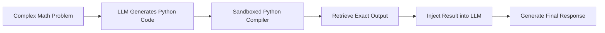

# Deterministic Mathematical & Symbolic Compilers

Language models frequently fail at exact math (multiplication, calculus, logic proofs) due to their token-based parametric nature. This paradigm translates word problems into code or symbolic instructions executed by deterministic engines.

## Architecture & Flow

The LLM translates an arithmetic problem into a program (e.g., Python code), which runs in a python sandbox to calculate the exact result.

## Key Characteristics
- **Zero Hallucination in Math:** Replaces language prediction with code execution.
- **Support for Symbolic Math:** Integrates tools like WolframAlpha, SymPy, or standard compilers.
- **Foundational Paper:** [PAL: Program-aided Language Models](https://arxiv.org/abs/2211.10435) (Gao et al., 2022).
