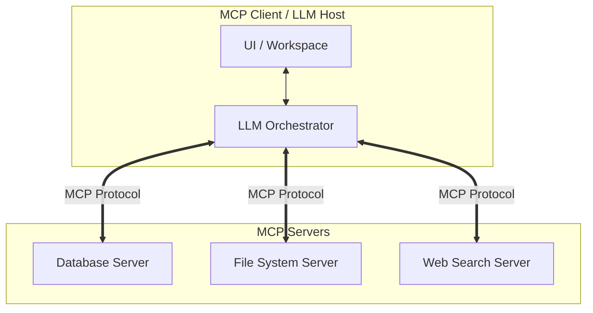

# The Standardized Model Context Protocol (MCP) Era (~2024–Present)

The Model Context Protocol (MCP), pioneered by Anthropic, provides an open-standard protocol for connecting AI models to diverse data sources and software tools. It resolves integration fragmentation by introducing a client-server architecture.

## Architecture & Flow

An MCP Client (e.g., an LLM Host, IDE, or Agent platform) communicates with one or more MCP Servers via standard transport layers, dynamically discovering resources, prompts, and tools.

## Key Characteristics
- **Unified Protocol:** Replaces custom API integrations for each model-tool pair with a standard protocol.
- **Dynamic Discovery:** Servers advertise their resources, tools, and prompts dynamically to the client.
- **Specification:** [Model Context Protocol Specification](https://modelcontextprotocol.io) (Anthropic, 2024).
