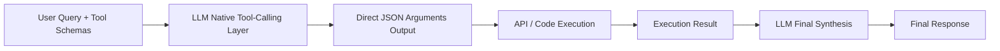

# The Native JSON Schema Tool-Calling Era (~2023–2024)

Instead of relying on fragile text parsing, the native tool-calling era introduced dedicated model fine-tuning where language models directly output structured arguments (most commonly JSON payloads) matching pre-defined schemas.

## Architecture & Flow

The system registers an array of available tools represented as JSON schemas. The LLM natively processes these schemas and generates structured function-calling parameters.

## Key Characteristics
- **Stable JSON Output:** Sub-layers in the models are optimized/fine-tuned to follow JSON schemas precisely, resolving the parsing failures of the ReAct era.
- **Parallel Tool Use:** Allows the model to emit multiple tool-calls in a single generation turn.
- **Foundational Paper:** [Toolformer: Language Models Can Teach Themselves to Use Tools](https://arxiv.org/abs/2302.04761) (Schick et al., 2023).
