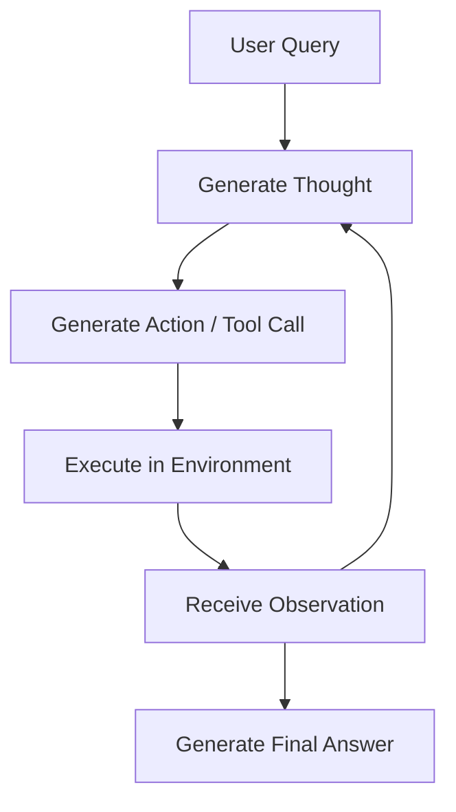

# The Prompt-Based ReAct Era (~2022–2023)

The ReAct (Reasoning + Acting) paradigm forms the conceptual foundation of modern agentic workflows. By prompting LLMs to generate alternating reasoning traces ("Thoughts") and environment-interacting actions ("Actions"), it enables dynamic problem-solving.

## Architecture & Flow

The model outputs its reasoning steps, calls a tool, observes the results, and repeats the loop.

## Key Characteristics
- **Handcrafted Prompts:** Relies on explicitly structured zero-shot or few-shot prompts (e.g., `Thought: ...`, `Action: ...`, `Observation: ...`).
- **Fragile Regex Parsing:** The loop depends heavily on regex rules to parse the text output of the model. Minor format variations can halt the agent loop.
- **Foundational Paper:** [ReAct: Synergizing Reasoning and Acting in Language Models](https://arxiv.org/abs/2210.03629) (Yao et al., 2022).
