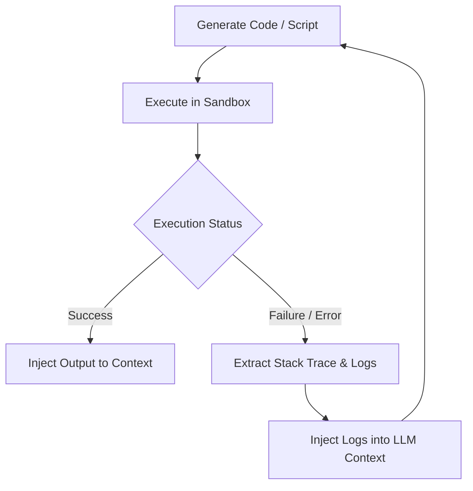

# Closed-Loop Self-Correction / Sandboxed Execution

Self-Correction combines execution tools with automated validation logs. If a sandbox compiler or script returns an error, the raw stack trace is fed back to the LLM as context, instructing it to diagnose and rewrite the arguments or code.

## Architecture & Flow

The code is executed in a sandbox. If an error occurs, the compiler logs are injected back into the LLM context to correct the script.

## Key Characteristics
- **Reduced Failures:** Automatically resolves syntax, logical, or runtime crashes in tool execution.
- **Developer Workflows:** Crucial for autonomous programming and mathematical solvers.
- **Foundational Paper:** [Reflexion: Language Agents with Verbal Reinforcement Learning](https://arxiv.org/abs/2303.11366) (Shinn et al., 2023).
