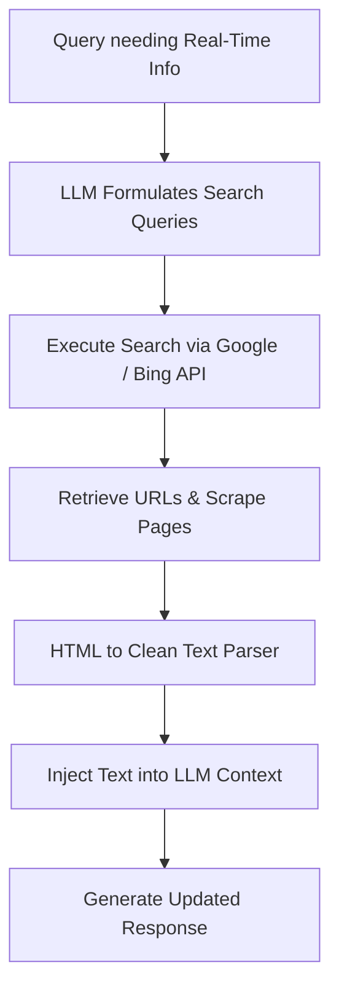

# Web Crawlers & Real-Time Search Engines

Web crawlers and search APIs prevent knowledge decay by supplying the LLM with live internet data. This allows the model to reference recent news, documentation updates, and global events.

## Architecture & Flow

The LLM determines search terms, queries an API, scrapes page HTML, and parses the content into clean text to form its response.

## Key Characteristics
- **No Knowledge Cutoff:** Grounded in web search results.
- **Source Citation:** Enables models to cite references and specific website links in their output.
- **Foundational Paper:** [WebGPT: Browser-assisted question-answering with human feedback](https://arxiv.org/abs/2112.09332) (Nakano et al., 2021).
